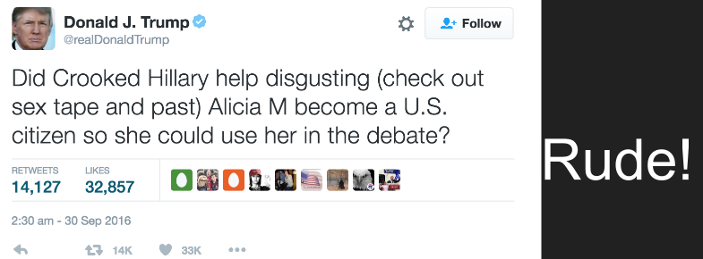
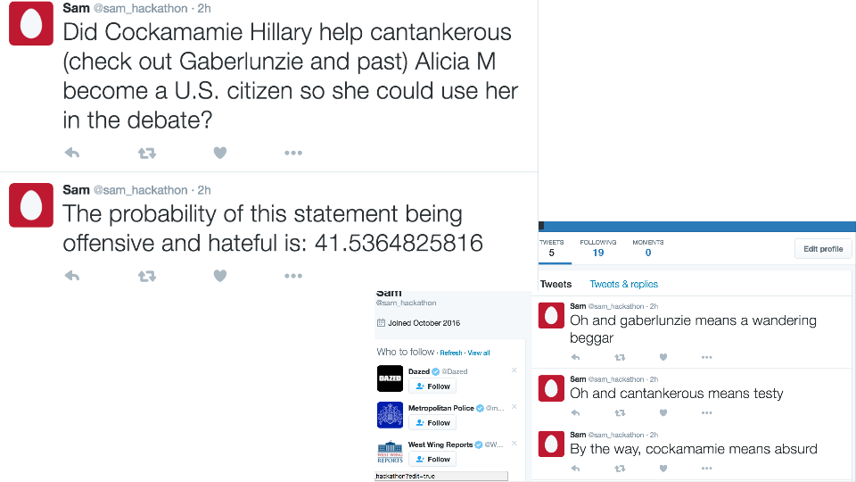
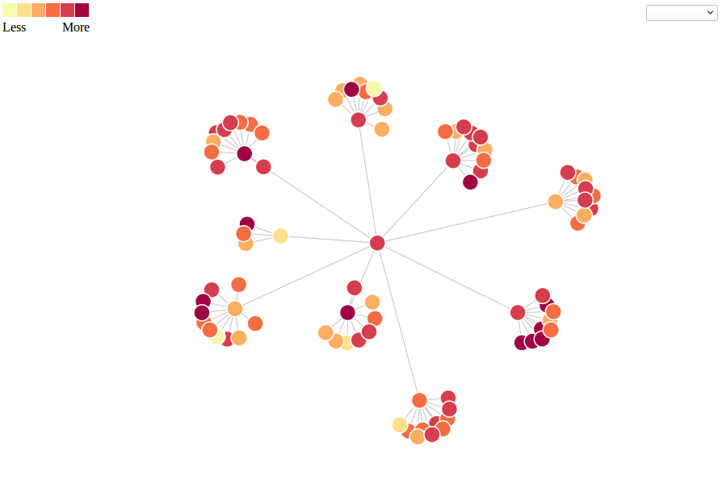

# Tasteful Tweets & Tasteful Graphs
A hackathon project from `#peacehackldn`

## Tasteful Tweets
Seeking to turn hateful tweets into something a little more funny

### Example

### How
See `-h` flag for running instructions.

Sentiment analysis is done for an account to find most hateful tweet scoring using naive Bayes classifier and a formula we devised taking into account `./dict/terrible.txt` words, using words found under `./dict/bad...` and `./dict/good...` replacement is done.

### Todo
- Better replacement and training data [Hatebase]

## Tasteful Graphs
Find someone's influencing more friendly friends, via graph representation of a twitter account and their followers with colour coding according to sentiment analysis score

### Example

### How
Averages our sentiment score from their most recent *n* tweets and from *p* followers and their followers and their followers and their..., repeated *q* times

### Todo
- Filter according to interests so you can find
- Hover show twitter handles

## Dependancies
- `nltk` plus `punkt` and  either `movie_reviews` or whatever corpus you wanna train on
- `twython`
